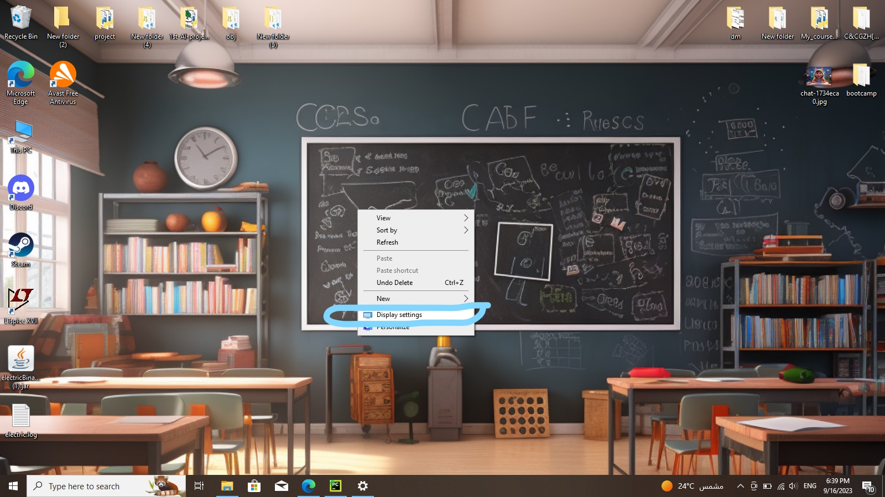
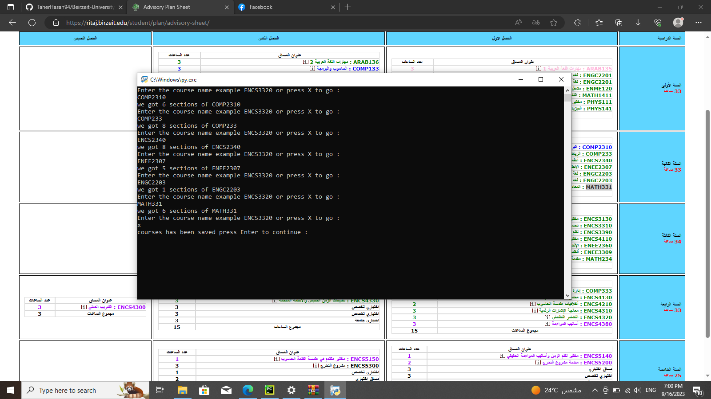
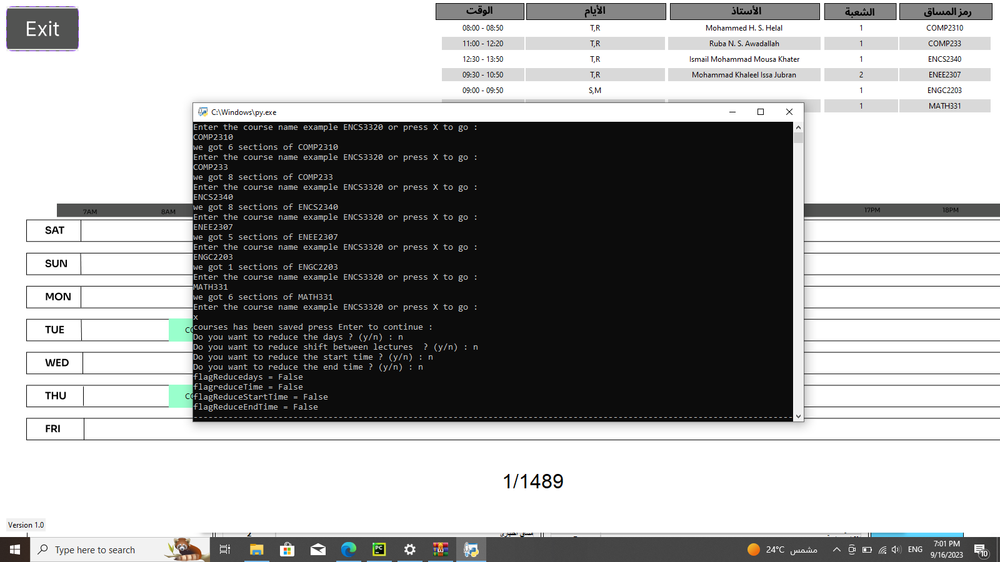
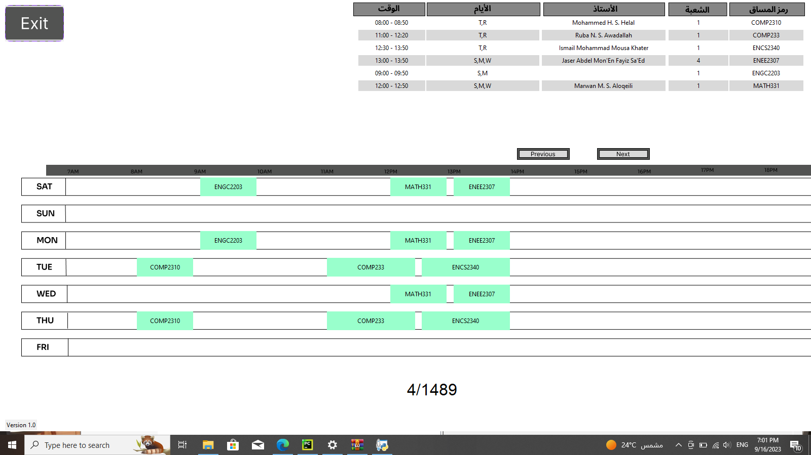
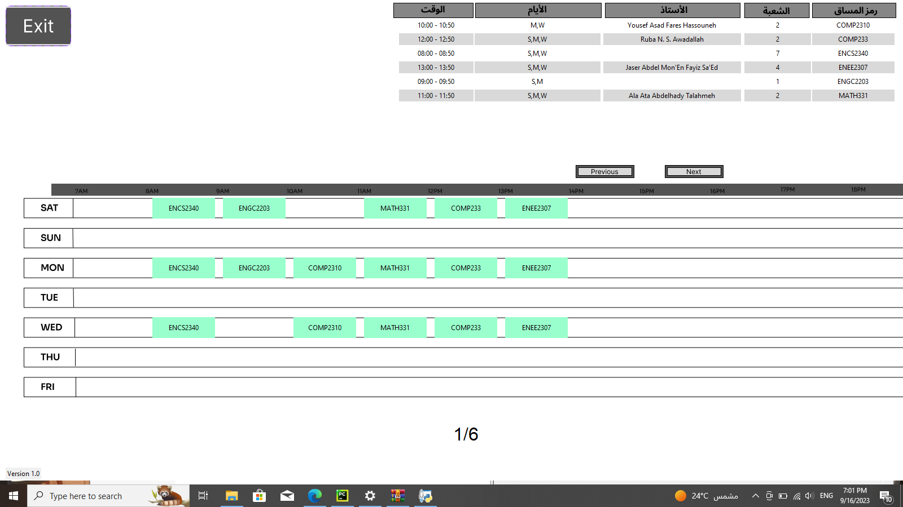

## فكرتي الخاصة (النسخة الأولى)                          9/17/2023
### برنامج صانع الجداول لجامعة بيرزيت متوفر فقط لاجهزة الحاسوب (بايثون) حاليا ... تأملاتي في المستقبل القريب أن يتم تحسين طريقة الكتابة وتوفيره على المتصفح وتصميمه كبرنامج على أجهزة الهاتف

## My Innovative Idea (Version 1.0)
### The Class Schedule Maker for Birzeit University is currently only available for computers (Python). In the near future, I envision enhancing its functionality by creating a web-based version and designing a mobile application.

## الهدف

يهدف هذا البرنامج إلى مساعدة طلبة جامعة بيرزيت في تصميم أفضل جدول للفصل الدراسي 
يساعد البرنامج في توفير جهود الطلبة ووقتهم إضافة إلى الحصول على أفضل جدول دراسي ممكن 

كما ويقدم البرنامج عدة خيارات للطالب منها تحديد عدد الأيام أو عدد ساعات الدوام أو ميزة الدوام الصباحي أو الجدول المتأخر 

يواجه البرنامج عدة مشاكل أهمها عدم القدرة على أخذ المعلومات من موقع صفحة الجامعة لوجود نظام حماية قوي إضافة إلى المعلومات المشفرة 

ومع ذلك وجدنا طريقة لتحويل المعلومات إلى ملف بصيغة "جسون" عن طريق فقط النسخ واللصق وبهذا يكون عيبه ان المعلومات يتم أخذها بشكل يدوي من قبل المستخدم قبل التشغيل  
## Goal
This program aims to assist Birzeit University students in creating an optimized class schedule for the semester. The program not only saves students time and effort but also ensures they have the best possible study timetable.

Additionally, the program offers several options to students, such as specifying the number of days or hours of classes, preferences for morning or late classes, and schedule flexibility.

The program encounters a few challenges, including the inability to automatically extract information from the university's website due to strong security measures and encrypted data. However, we have found a way to convert data into a "JSON" file by simple copy-pasting. The drawback is that users need to input the information manually before running the program.

### مشاكل في البرنامج أسعى لحلها مستقبلا ...
#### - لا يعمل على الويب أو على أجهزة الموبايل
#### - لا تتوفر طريقة تلقائية لاستخراج المعلومات من موقع ريتاج بل عن طريق برنامج يعمل على ترتيب معين في حال تم تغيير طريقة عرض المعلومات في موقع ريتاج ولو تغيير بسيط سيتوقف البرنامج عن العمل
#### - برنامج العرض GUI يعمل فقط عبى لأجهزة الحاسوب وان كان عرض دقة الشاشة resoluation مختلف عن 1600x900 سيظهر البرنامج بشكل سيء

### Future Challenges to Address
#### - Lack of compatibility with web browsers and mobile devices.
#### - The absence of an automated information extraction method from the Ritaj University website. The program relies on a specific format, and any minor changes to the presentation of information on the website may disrupt its functionality.
#### - The graphical user interface (GUI) of the program only works on computers, and if the screen resolution differs from 1600x900, the program may display poorly.

في البداية وقبل أن نبدأ بأي شيء يجب الـتأكد من اعدادات العرض للشاشة "1600x900"

Before we begin, it's essential to ensure that the screen resolution is set to "1600x900".

## تحضرير بيانات الجامعة

## University Data Preparation

سنذهب إلى "مستعرض المساقات" ثم نختار " الفصل الدراسي "

ونبحث عن مقدمة المواد التي نريدها على سبيل مثال مواد هندسة الحاسوب "ENCS" 

To start, we navigate to the "Course Browser" and select the "Semester."

Then, we look for course introductions that we need, such as Computer Engineering courses "ENCS."

بعد ذلك يجب علينا تحويل لغة العرض إلى اللغة الإنجليزية

Next, we switch the language to English.

ثم ننسخ كل الصفحة المعروضة

Then, we copy the entire displayed page.

في مجلد "coursesTXT" نقوم بإنشاء ملف جديد بإسم مقدمة المواد "ENCS" ويجب ان تكون الحروف كبيرة 

In the "coursesTXT" folder, we create a new file with the name of the subject introduction, in uppercase letters, such as "ENCS."

سيظهر لنا ملف "ENCS.json" في مجلد "coursesJSON"

Now, we convert the information into a "JSON" file using the "prepare JSON file" executable. We enter the name of the engineering subject, "ENCS," and press "ENTER."

A "ENCS.json" file will appear in the "coursesJSON" folder.

##  طريقة تشغيل برنامج المقارنة

## Running the Comparison Program

واخيرا نذهب إلى ملف التشغبل "runme" وبامكاننا ان نضيف أي مادة تبدأ ب"ENCS" (سنكرر نفس الخطواط السابقة لإضافة أي مواد من تخصصات مختلفة مثل MATH ARAB ect

Finally, we go to the "runme" file, and we can add any subject starting with "ENCS" (we repeat the same steps to add subjects from different disciplines, such as MATH, ARAB, etc.).

سنستمر في إضافة المواد وعندما ننتهي نضغط على x 

Then, we select the specifications we want, at the end we will press 'x'.

وبهذا يكون لدينا عدد من المجموعات المتاحة لاختيار الجدول الذي يناسبك وكما هو ظاهر في الصورة فيوجد 1489 مجموعة من الشعب الغير متعارضة مع بعضها البعض والتي يمكن التسجيل فيها

This way, we have multiple sets available to choose from, as shown in the image, with 1,489 sets of non-conflicting classes that can be registered for.

ومع اختيارنا لتقليل عدد الايام وغيرها من المواصفات التي تحسن من الجدول الدراسي تبقى لنا 6 مجموعات كأفضل مجموعة شعب تتوافق مع بعضها البعض 

By choosing to reduce the number of days and other specifications to improve the class schedule, we are left with the top 6 sets of class schedules that are compatible with each other.
