## فكرتي الخاصة (النسخة الأولى)
### برنامج صانع الجداول لجامعة بيرزيت متوفر فقط لاجهزة الحاسوب (بايثون) حاليا ... تأملاتي في المستقبل القريب أن يتم تحسين طريقة الكتابة وتوفيره على المتصفح وتصميمه كبرنامج على أجهزة الهاتف
### This program for Birzeit University is currently only available for computers (python). My hopes for the near future include improving it by adding a browser-based (WEB) version and making it accessible on mobile devices as a mobile application.

my own idea to build (version 1.0)

## الهدف

يهدف هذا البرنامج إلى مساعدة طلبة جامعة بيرزيت في تصميم أفضل جدول للفصل الدراسي 
يساعد البرنامج في توفير جهود الطلبة ووقتهم إضافة إلى الحصول على أفضل جدول دراسي ممكن 

كما ويقدم البرنامج عدة خيارات للطالب منها تحديد عدد الأيام أو عدد ساعات الدوام أو ميزة الدوام الصباحي أو الجدول المتأخر 

يواجه البرنامج عدة مشاكل أهمها عدم القدرة على أخذ المعلومات من موقع صفحة الجامعة لوجود نظام حماية قوي إضافة إلى المعلومات المشفرة 

ومع ذلك وجدنا طريقة لتحويل المعلومات إلى ملف بصيغة "جسون" عن طريق فقط النسخ واللصق وبهذا يكون عيبه ان المعلومات يتم أخذها بشكل يدوي من قبل المستخدم قبل التشغيل  

## Goal

This program aims to assist students at Birzeit University in designing a better class schedule for the semester. The program helps students save effort and time while obtaining the best possible study timetable.

Additionally, the program offers several options for the students, including specifying the number of days or hours of classes, the preference for morning or late classes, and the schedule flexibility.

The program faces several challenges, including the inability to extract information from the university's website due to strong security measures and encrypted data. However, we have found a way to convert the data into a "JSON" file by simply copying and pasting. The drawback is that users need to manually input the information before running the program.

## طريقة تحضرير البيانات الجامعة
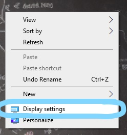
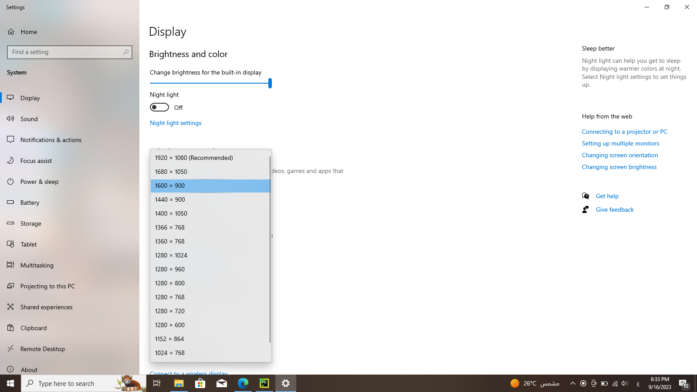
في البداية وقبل أن نبدأ بأي شيء يجب الـتأكد من اعدادات العرض للشاشة "1600x900" 
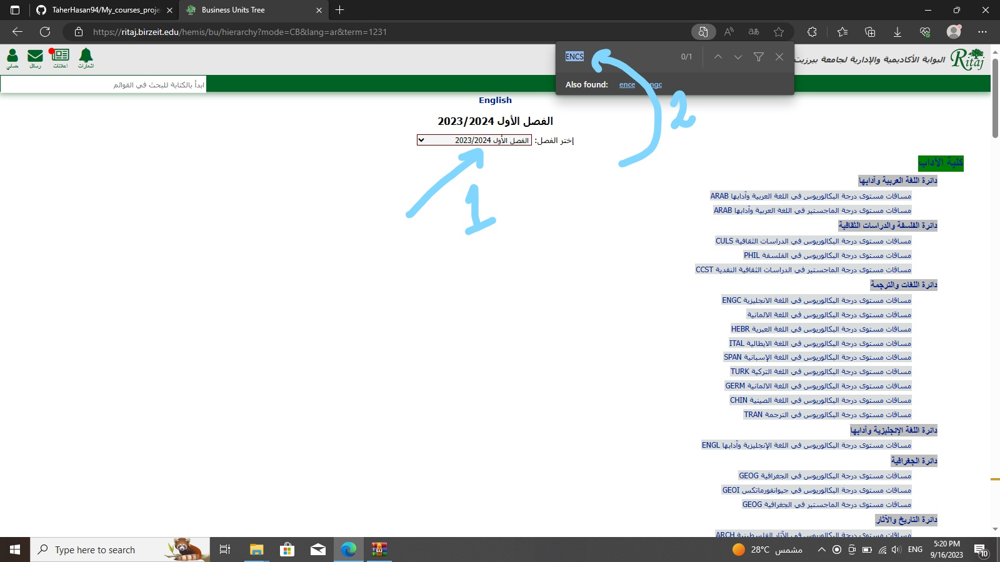
في البداية سنذهب إلى "مستعرض المساقات" ثم نختار " الفصل الدراسي "
ونبحث عن مقدمة المواد التي نريدها على سبيل مثال مواد هندسة الحاسوب "ENCS" 
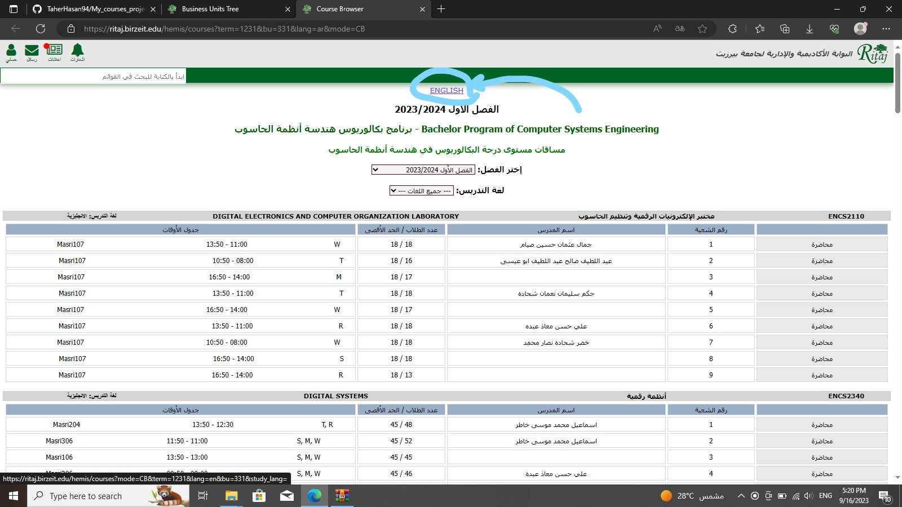
بعد ذلك يجب علينا تحويل لغة العرض إلى اللغة الإنجليزية
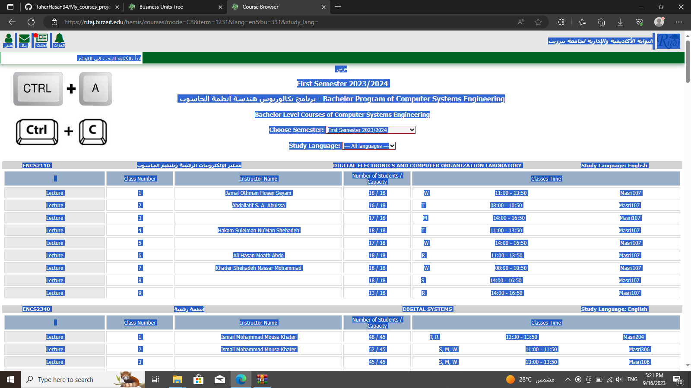
ثم ننسخ كل الصفحة المعروضة 
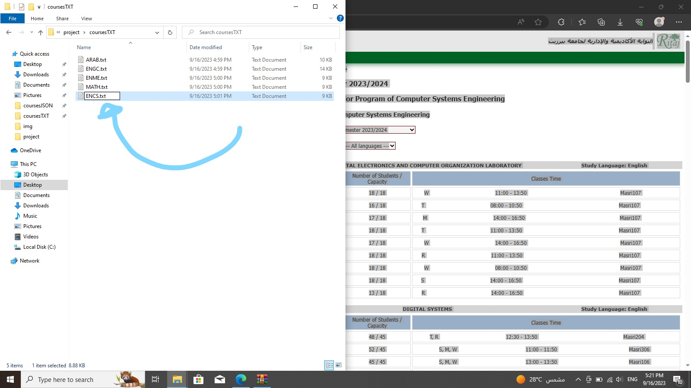
في مجلد "coursesTXT" نقوم بإنشاء ملف جديد بإسم مقدمة المواد "ENCS" ويجب ان تكون الحروف كبيرة 
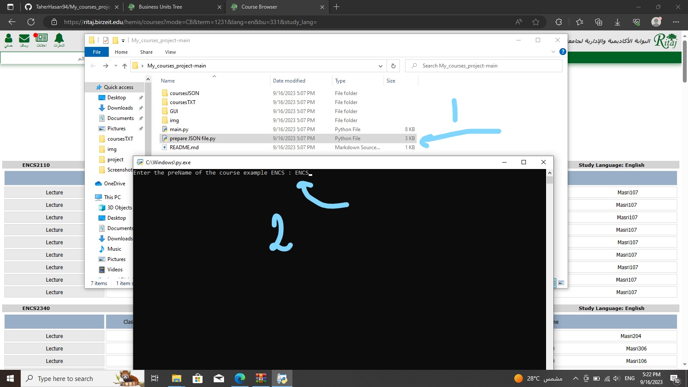
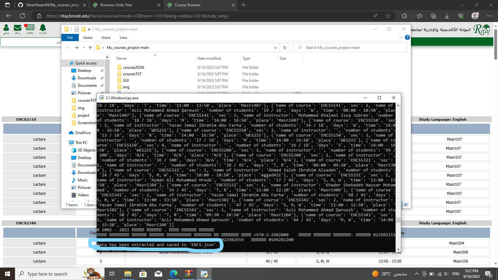
الان نحول المعلومان إلى ملف بامتداد "JSON" عن طريق ملف التشغيل "prepare JSON file" ونكتب اسم مقدمة المواد الهندسية "ENCS" ونضغط على "ENTER"
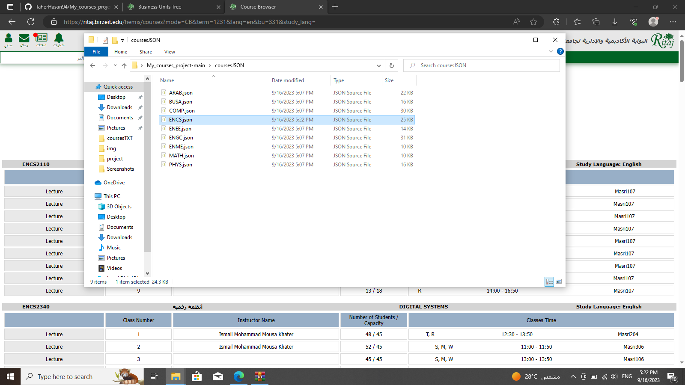
سيظهر لنا ملف "ENCS.json" في مجلد "coursesJSON" 
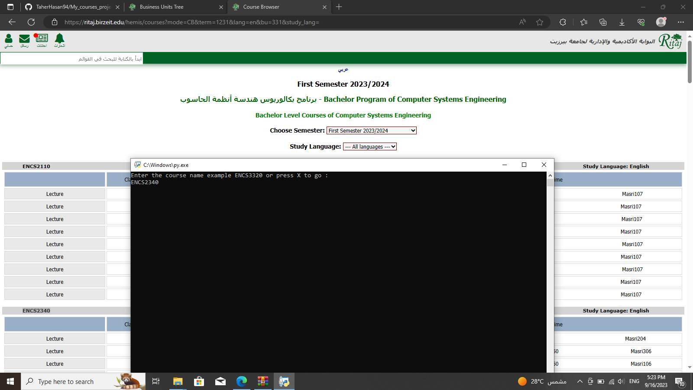
## طريقة تشغيل برنامج المقارنة
واخيرا نذهب إلى ملف التشغبل "runme" وبامكاننا ان نضيف أي مادة تبدأ ب"ENCS" (سنكرر نفس الخطواط السابقة لإضافة أي مواد من تخصصات مختلفة مثل MATH ARAB ect
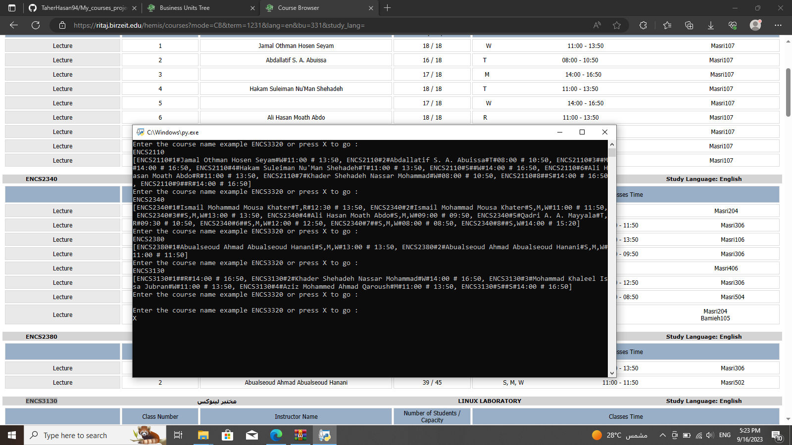
سنستمر في إضافة المواد وعندما ننتهي نضغط على x 
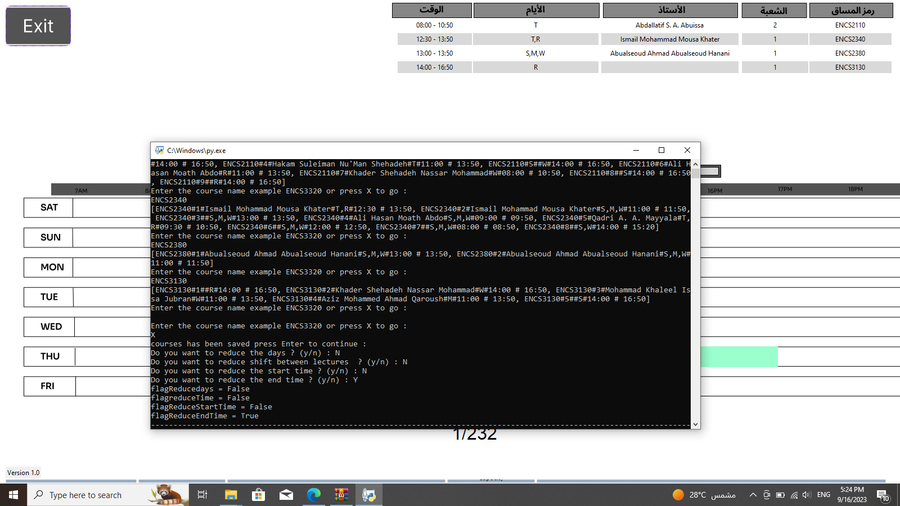
ثم نختار المواصفات التي نريدها 
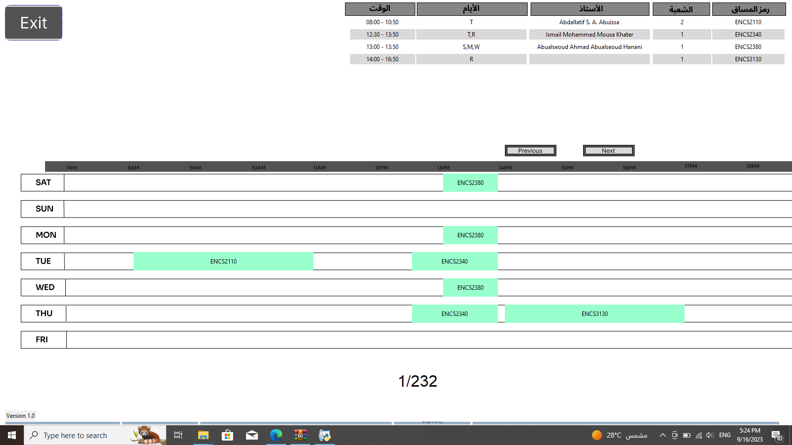
وبهذا يكون لدينا عدد من المجموعات المتاحة لاختيارك الجدول الذي يناسبك
